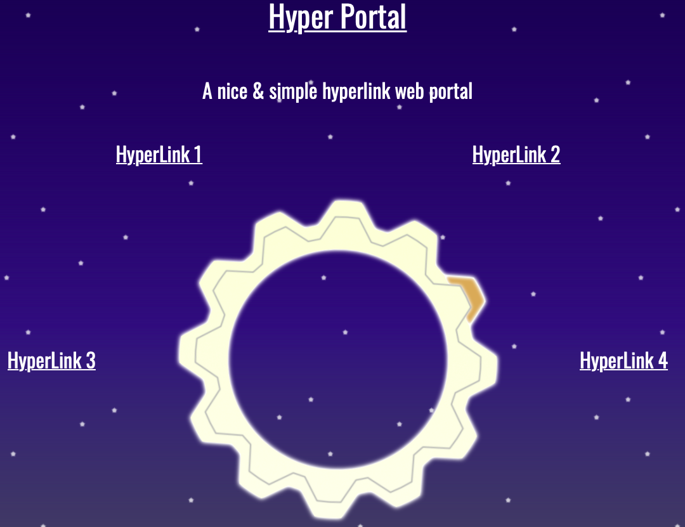

# Hyper Portal
A nice & simple **HTML5 & CSS3** *hyperlink* web portal

----------
## Installation
1. Download this repository to your web root folder
2. Add your own hyperlinks directly in the index.html file, see **a** tags with *portal_link* class
3. Change the portal title and slogan : see heading tags *portal_name* and *portal_slogan*
----------
## Version
### v1
* Animated background - OK
* Animated portal - OK
* Responsive design - OK
* OswaldFont via Google Fonts - OK
### v2
* Adapt background colors depending on time of day
* Make title, slogan & hyperlinks configurable via configuration file
* Adapt number of visible hyperlinks depending on count of hyperlinks in configuration file
* Make portal image follow mouse on hover
* Add hyperlink animation
* Add hyperlink dropdown description on mouse hover
* Add other portal layouts
* Add artwork source files to git repository
----------
## Licence
Hyper Portal is released under the GNU GPL v3
